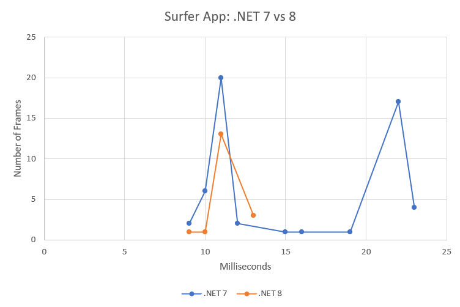

# maui-scrolling-performance

Test repository for measuring scrolling performance of .NET MAUI apps on Android.

Measuring scrolling peformance on Android is a bit tricky. The
[Android docs][android-docs] describe a [`FrameMetricsAggregator`][frame-metrics]
class we can use to measure frame times or as Google calls it, "jank".

We can use this to measure the scrolling performance of .NET MAUI apps.

[android-docs]: https://developer.android.com/topic/performance/measuring-performance
[frame-metrics]: https://developer.android.com/reference/androidx/core/app/FrameMetricsAggregator

## How to Setup?

In `Platforms/Android/MainActivity.cs`:

```csharp
protected override void OnCreate(Bundle savedInstanceState)
{
    base.OnCreate(savedInstanceState);
    Android.FrameMetrics.FrameMetricsReporter.Initialize(this);
}
```

Build & run your app in `Release` mode:

```dotnetcli
dotnet build -c Release -t:Run
```

Find out the name of the current activity:

```powershell
> adb shell 'dumpsys window | grep mCurrentFocus'
  mCurrentFocus=Window{f01fc52 u0 com.companyname.surfingapp/crc6435627e4593d70ff9.MainActivity}
```

Run the script:

```powershell
.\scripts\scroll-performance.ps1 -package com.companyname.surfingapp -activity crc6435627e4593d70ff9.MainActivity
...
05-08 14:55:47.347 31085 31085 I DOTNET  : Frame(s) that took ~9ms, count: 2
05-08 14:55:47.348 31085 31085 I DOTNET  : Frame(s) that took ~10ms, count: 6
05-08 14:55:47.348 31085 31085 I DOTNET  : Frame(s) that took ~11ms, count: 20
05-08 14:55:47.348 31085 31085 I DOTNET  : Frame(s) that took ~12ms, count: 2
05-08 14:55:47.348 31085 31085 I DOTNET  : Frame(s) that took ~15ms, count: 1
05-08 14:55:47.348 31085 31085 I DOTNET  : Frame(s) that took ~16ms, count: 1
05-08 14:55:47.348 31085 31085 I DOTNET  : Frame(s) that took ~19ms, count: 1
05-08 14:55:47.367 31085 31085 I DOTNET  : Frame(s) that took ~22ms, count: 17
05-08 14:55:47.367 31085 31085 I DOTNET  : Frame(s) that took ~23ms, count: 4
05-08 14:55:47.368 31085 31085 I DOTNET  : Average frame time: 15.52ms
05-08 14:55:47.368 31085 31085 I DOTNET  : No. of slow frames: 23
05-08 14:55:47.368 31085 31085 I DOTNET  : -----
```

This scrolls this app a few times and prints out the average frame
time and the number of frames that took longer than 16ms (60fps).


## Comparing .NET 7 and .NET 8

Testing [this branch](https://github.com/jonathanpeppers/maui/tree/net8.0-FAST)
to just bring some of the very latest changes over.

```powershell
05-08 15:45:52.946  5684  5684 I DOTNET  : Frame(s) that took ~9ms, count: 1
05-08 15:45:52.947  5684  5684 I DOTNET  : Frame(s) that took ~10ms, count: 1
05-08 15:45:52.947  5684  5684 I DOTNET  : Frame(s) that took ~11ms, count: 13
05-08 15:45:52.947  5684  5684 I DOTNET  : Frame(s) that took ~13ms, count: 3
05-08 15:45:52.947  5684  5684 I DOTNET  : Average frame time: 11.17ms
05-08 15:45:52.947  5684  5684 I DOTNET  : No. of slow frames: 0
05-08 15:45:52.947  5684  5684 I DOTNET  : -----
```

The average frame time dropped from 15.52ms to 11.17ms, and we no
longer have any frames that take longer than 16ms (or 60 fps).

If we plot these timings, you can get an interesting comparison:


